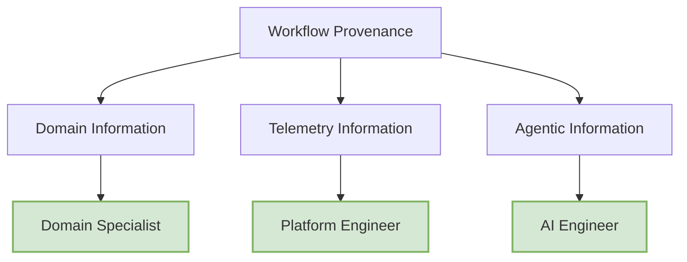

# Provenance Stakeholders and Information Needs

## 1. Domain Specialist

**Description:**
A domain expert who uses scientific workflows and agentic systems to support research activities but is not necessarily involved in workflow implementation. Their primary concern is understanding, validating, and reproducing scientific results.

**Example Actors:**

* Geoscientist
* Biologist
* Chemist
* Climate Scientist
* Medical Researcher

**Primary Interests:**

* Domain Information (**High**)
* Workflow Provenance (**Medium–High**)
* Telemetry Information (**Low**)
* Agentic Provenance (**Low**)

**Representative Questions:**

* Execution Traceability

    1. What inputs and parameters were used in this execution?
    2. What outputs were generated by the workflow?
    3. What intermediate results were produced throughout the execution?
    4. Which sequence of workflow activities led to this result?
    5. Can this execution be reproduced using the captured information?
* Comparative Analysis

    6. How does this execution differ from a previous execution?
    7. Which executions of task X used different parameter configurations?
    8. How did changes in inputs or parameters affect the final outputs?
* Experiment Exploration

    9. Which parameter configuration produced the best result?

## 2. Platform Engineer

**Description:**
A professional responsible for operating, maintaining, and troubleshooting the infrastructure that supports workflow execution. Their focus is on performance, reliability, resource utilization, and failure diagnosis.

**Example Actors:**

* Platform Engineer
* MLOps Engineer
* HPC Administrator
* DevOps Engineer
* Site Reliability Engineer (SRE)

**Primary Interests:**

* Telemetry Information (**High**)
* Workflow Provenance (**High**)
* Domain Information (**Low**)
* Agentic Provenance (**Low–Medium**)

**Representative Questions:**

* Performance Analysis

    1. How long did each task take to execute?
    2. Which task had the longest execution time?
    3. What was the total workflow execution time?

* Resource Utilization

    5. Which tasks consumed the most CPU?
    6. Which tasks consumed the most memory?
    7. Which tasks generated the most disk activity?
    8. Which tasks generated the most network activity?

* Failure Diagnosis

    9. Which tasks failed during execution?
    10. What error messages were produced by failed tasks?
    11. Which workflow executions had the highest failure rate?
    12. Did failures occur in specific tasks, agents, nodes, or environments?

* Infrastructure and Runtime Context

    13. On which node or host did each task execute?
    14. Which users or environments triggered the execution?
    15. Did resource usage vary across nodes, hosts, or runtime environments?

## 3. AI Engineer

**Description:**
A developer or researcher responsible for designing, evaluating, and improving multi-agent systems. Their primary interest is understanding agent behavior, coordination mechanisms, delegation patterns, and communication dynamics.

**Example Actors:**

* AI Engineer
* Agentic Systems Researcher
* Multi-Agent Systems Researcher
* LLM Application Developer
* AI Framework Developer

**Primary Interests:**

* Agentic Provenance (**High**)
* Workflow Provenance (**High**)
* Telemetry Information (**Medium**)
* Domain Information (**Medium**)

**Representative Questions:**

1. Which agents participated in this execution?
2. Which agent created or launched another agent?
3. Which agent invoked action X?
4. Which agents communicated during execution?
5. What messages were exchanged between agents?
6. Which agent produced a specific output?
7. How was work delegated across agents?
8. Which agent was responsible for a failure?
9. Which agent interacted most frequently with other agents?
10. How did agent interactions evolve throughout the execution?
